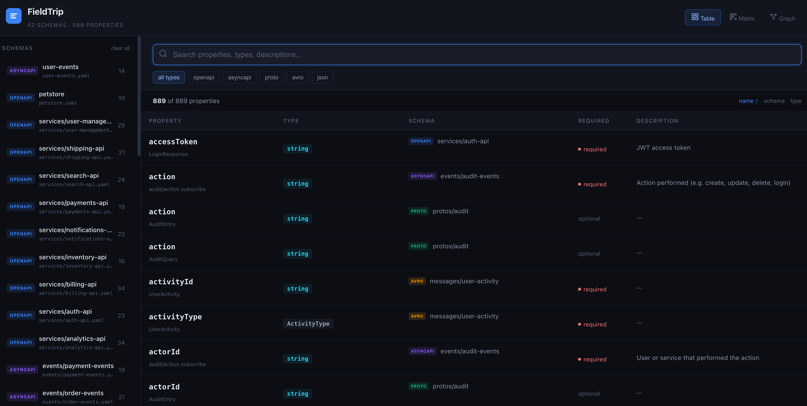
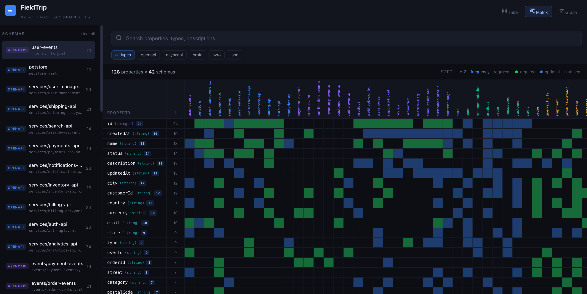
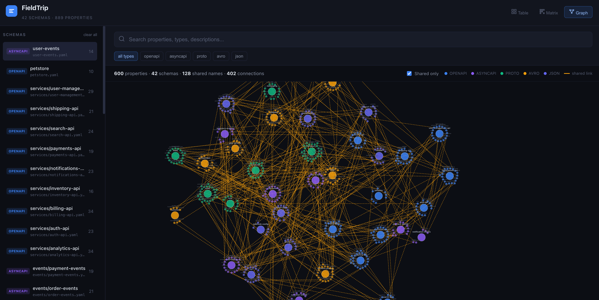

<div align="center">

# FieldTrip

**Instantly search, explore, and visualize every field across your schemas.**

Point it at a directory. It finds your OpenAPI, AsyncAPI, Protobuf, Avro, and JSON Schema files, indexes every property, and launches a local UI to explore them.

[](LICENSE)
[](https://www.npmjs.com/package/@eventcatalog/fieldtrip)

</div>

---



## Why FieldTrip?

Schema sprawl is real. When your system has dozens of services each with their own schema definitions, it becomes impossible to answer simple questions:

- *"Which schemas use a `customerId` field?"*
- *"Is `email` required everywhere it appears?"*
- *"What fields does `Order` share with `Payment`?"*

FieldTrip answers these in seconds. One command, zero config.

## Quick Start

```bash
npx @eventcatalog/fieldtrip --dir ./schemas
```

That's it. FieldTrip scans the directory, indexes every property, and opens a local UI at `http://localhost:3200`.

## Features

### Table View — Search & Filter

Full-text search across all property names, types, and descriptions. Filter by schema type, sort by name/schema/type, and click any property to view it in context with syntax highlighting.

- Prefix and fuzzy matching
- Exact match with `"quoted strings"`
- Filter by schema type (OpenAPI, AsyncAPI, Proto, Avro, JSON)
- Filter by specific schema files via the sidebar
- Click any row to view the full schema with the property highlighted


### Matrix View — Property x Schema

See which properties appear in which schemas at a glance. A heatmap-style grid where rows are properties and columns are schemas.

- Green cells = required, Blue cells = optional
- Hover to see type, schema, and required status
- Sort by frequency, alphabetical, or required count
- Instantly spot shared fields across your architecture



### Graph View — Force-Directed Relationships

Visualize how schemas are connected through shared properties. Schema nodes cluster with their properties, and shared fields create visible bridges between schemas.

- D3.js force-directed simulation
- Click a property to highlight all schemas sharing that field
- Click a schema to highlight all its properties
- "Shared only" toggle to reduce noise
- Drag, zoom, and pan



## Supported Schemas

| Format | Extensions | What's indexed |
|--------|-----------|---------------|
| **OpenAPI** | `.yaml` `.yml` `.json` | Components, definitions, inline request/response bodies |
| **AsyncAPI** | `.yaml` `.yml` `.json` | Components, messages, channel payloads (v2 & v3) |
| **Protobuf** | `.proto` | Messages, enums, nested types |
| **Avro** | `.avsc` | Records, nested records, unions, arrays, maps |
| **JSON Schema** | `.json` | Properties, nested objects, allOf/oneOf/anyOf |

## CLI Options

```
Usage: fieldtrip [options]

Options:
  --dir <path>     Directory to scan for schema files (required)
  --port <number>  Port for the web UI (default: 3200)
  --no-open        Do not auto-open browser
  -h, --help       Display help
```

## Development

```bash
# Install dependencies
npm install

# Run in dev mode
npm run dev

# Build for production
npm run build
```

## How It Works

1. **Scan** — Recursively finds schema files by extension and content detection
2. **Parse** — Extracts every property with its name, type, description, path, and required status
3. **Index** — Builds a MiniSearch full-text index with prefix search and fuzzy matching
4. **Serve** — Launches an Express server with a Vite-built frontend

## License

[MIT](LICENSE)
